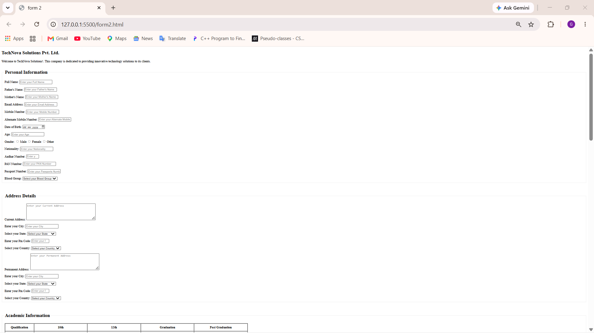
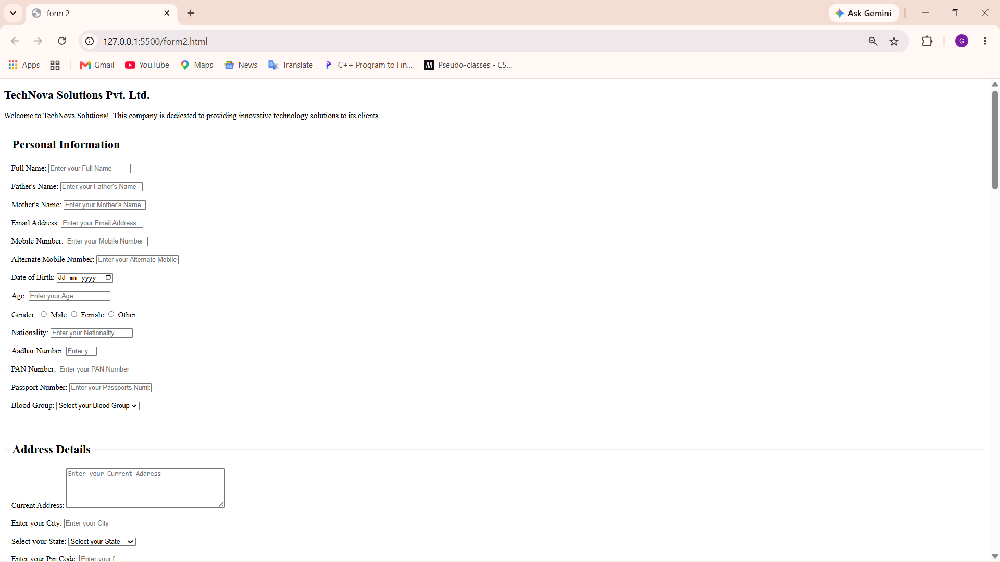
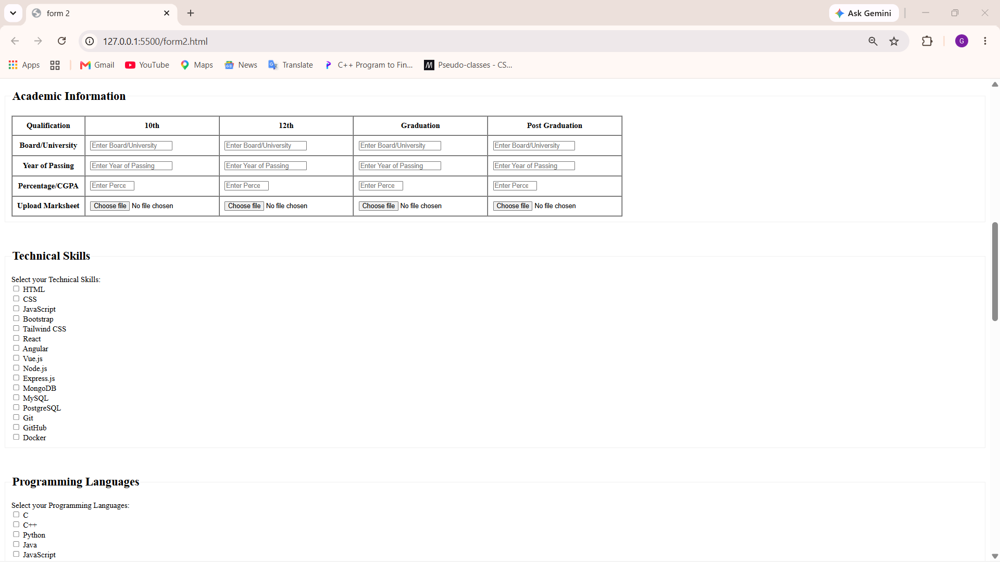
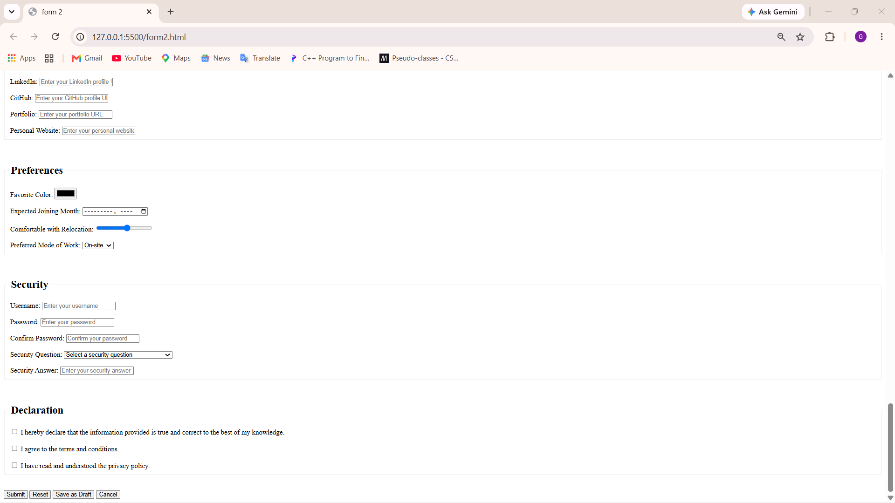

# Day 3 - Job Application Form

## Day 3 of My Web Development Journey 🚀

A complete Job Application Form built using HTML5.

## 🛠️ Technologies Used

- HTML5
- HTML Forms
- HTML Tables

## 📚 What I Learned

- Different HTML input types
- Form structure using fieldset and legend
- Radio buttons and checkboxes
- Select dropdowns
- Textarea
- File uploads
- HTML tables
- Form validation using required and input attributes
- Date, time, week, month and datetime inputs

## ✨ Features

- Personal Information
- Address Details
- Academic Information
- Technical Skills
- Programming Languages
- Experience Details
- Job Preferences
- Document Upload
- Availability
- Social Media Links
- Security
- Declaration

## 🖥️ Project Preview

### Output 1

### Output 2

### Output 3

### Output 4

## 📁 Project Files

- `form2.html` - Complete HTML source code
- `output1.png` - Project output
- `output2.png` - Project output
- `output3.png` - Project output
- `output4.png` - Project output
